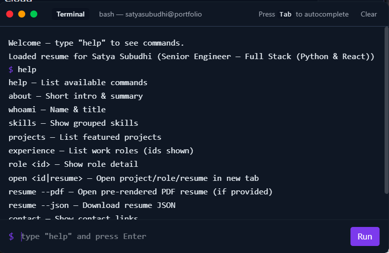

# Portfolio Website

A modern, responsive portfolio website built with React, TypeScript, and Tailwind CSS. Features an interactive project showcase, skills visualization, CLI-style resume, and smooth animations.

🔗 **Live Demo**: [https://miracleflow.github.io/portfolio](https://miracleflow.github.io/portfolio)

> Free, modern developer portfolio template with:
>
> - CLI-style resume
> - Animated skill visualizations
> - Dark/light theme
> - Markdown-powered project content

## 📸 Preview




## ✨ Features

- **Interactive Portfolio**: Showcase your projects with modal views and detailed descriptions
- **Dynamic Resume**: Interactive resume page with print functionality
- **CLI Resume**: Terminal-style resume interface for a unique user experience
- **Skills Visualization**: Circular progress bars and interactive skill displays
- **Theme Support**: Dark/Light theme toggle with smooth transitions
- **Smooth Animations**: Powered by Framer Motion for engaging UI interactions
- **Markdown Support**: Project descriptions rendered with GitHub-flavored markdown
- **Contact Form**: Interactive contact form for visitor inquiries
- **Responsive Design**: Fully responsive across all device sizes
- **Scroll Enhancements**: Progress bar and scroll-to-top functionality

## 🚀 Use this as your own portfolio

This repository is intended to be a ready-to-customize portfolio template. There are two easy ways to get started:

### Option A — Use the GitHub "Use this template" button

1. On the GitHub page for this repo click the **"Use this template"** button
2. Create a new repository under your account
3. Clone your new repo locally and follow the quick-start checklist below

### Option B — Clone directly

```bash
git clone https://github.com/miracleflow/portfolio.git my-portfolio
cd my-portfolio
npm install
npm run dev
```

Quick start (do these first)

- Open `src/config/portfolioData.ts` and replace the sample data with your name, bio, links, and projects — this is the single most important file to customize.
- Replace social/profile links and contact details.
- Update or remove example projects (the `projects` array) and add your screenshots or links.
- (Optional) Add preview images in `public/` named `preview-home.png`, `preview-projects.png`, `preview-cli.png` so the GitHub template page renders them.
- If you plan to deploy to GitHub Pages, update `package.json` -> `homepage` and `vite.config.ts` -> `base`.

Why `src/config/portfolioData.ts`?

All site content (projects, skills, education, experience, and basic profile info) is driven by `src/config/portfolioData.ts`. Editing that file is the fastest way to make this site yours.

## ☁️ One-click Deploy

[](https://vercel.com/new/clone?repository-url=https://github.com/miracleflow/portfolio)

[](https://app.netlify.com/start/deploy?repository=https://github.com/miracleflow/portfolio)

## 🛠️ Tech Stack

### Core

- **React 19** - UI framework
- **TypeScript** - Type safety and better developer experience
- **Vite** - Fast build tool and dev server
- **React Router DOM** - Client-side routing

### Styling

- **Tailwind CSS 4** - Utility-first CSS framework
- **Framer Motion** - Animation library
- **Lucide React** - Icon library
- **React Icons** - Additional icon sets

### Additional Libraries

- **React Markdown** - Markdown rendering
- **React Circular Progressbar** - Skill visualization
- **React Scroll** - Smooth scrolling functionality
- **GitHub Markdown CSS** - GitHub-style markdown styling

## 📁 Project Structure

```
src/
├── components/          # Reusable UI components
│   ├── shared/         # Shared components (Header, Footer, etc.)
│   └── resume/         # Resume-specific components
├── pages/              # Page components
│   ├── PortfolioPage.tsx
│   └── ResumePage.tsx
├── config/             # Configuration files
│   └── portfolioData.ts
├── context/            # React contexts (Theme)
├── types/              # TypeScript type definitions
└── assets/             # Static assets
```

## 🚀 Getting Started

### Prerequisites

- Node.js (v18 or higher)
- npm or yarn package manager

### Installation

1. Clone the repository:

```bash
git clone https://github.com/miracleflow/portfolio.git
cd portfolio
```

2. Install dependencies:

```bash
npm install
```

3. Start the development server:

```bash
npm run dev
```

4. Open your browser and navigate to `http://localhost:5173`

## 📝 Available Scripts

- `npm run dev` - Start development server
- `npm run build` - Build for production
- `npm run preview` - Preview production build locally
- `npm run lint` - Run ESLint
- `npm run deploy` - Deploy to GitHub Pages

## 🎨 Customization

### Update Portfolio Data

Edit `src/config/portfolioData.ts` to customize:

- Personal information
- Projects
- Skills
- Experience
- Education

### Modify Theme

Theme configuration is managed through `src/context/ThemeContext.ts` and `src/components/ThemeProvider.tsx`.

### Styling

Tailwind configuration can be modified in `tailwind.config.js`.

## 🌐 Deployment

This project is configured for deployment to GitHub Pages:

1. Update the `homepage` field in `package.json` with your GitHub Pages URL
2. Update the `base` field in `vite.config.ts` to match your repository name
3. Run the deployment command:

```bash
npm run deploy
```

## 📄 License

This project is open source and available under the [MIT License](LICENSE).

## 👤 Author

**Kevin Pang**

- GitHub: [@miracleflow](https://github.com/miracleflow)
- Email: kevinpang8142@gmail.com

## 🤝 Contributing

Contributions, issues, and feature requests are welcome! Feel free to check the [issues page](https://github.com/miracleflow/portfolio/issues).

---

Built with ❤️ using React + TypeScript + Vite
